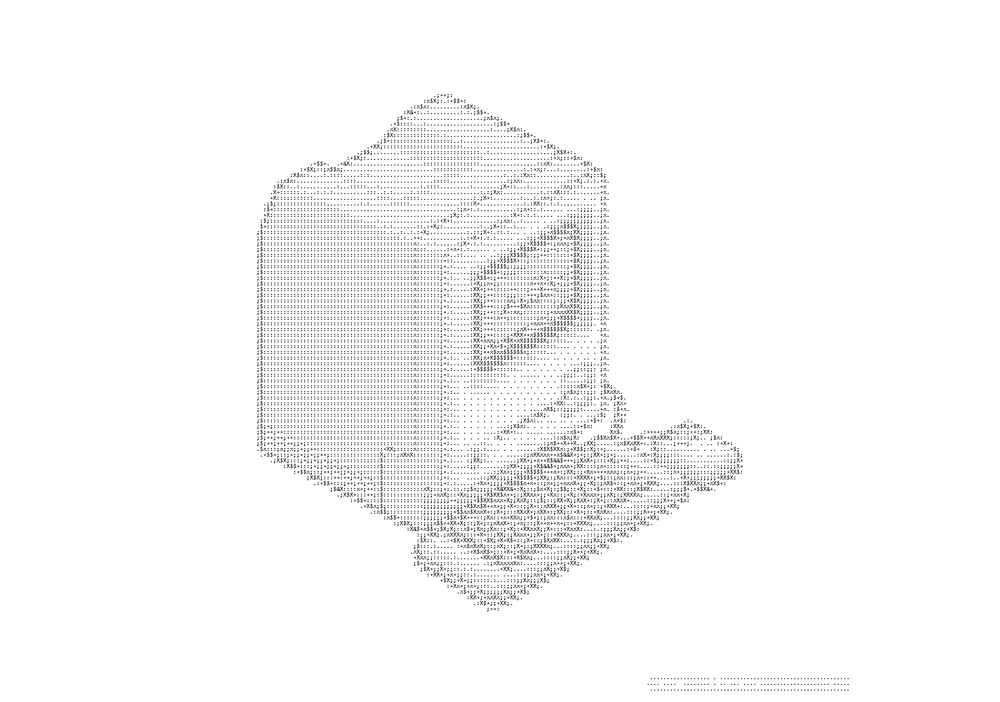

# The Founder Studies

Technical resources for startup founders and engineers.

## Contents

### Phase 1

- Structure and Interpretation of Computer Programs
  - Harold Abelson, Gerald Jay Sussman, Julie Sussman
- Concrete Mathematics
  - Ronald L. Graham, Donald E. Knuth, Oren Patashnik
- Introduction to Algorithms
  - Thomas H. Cormen, Charles E. Leiserson, Ronald L. Rivest, Clifford Stein

---

### Phase 2

- Computer Organization and Design: The Hardware/Software Interface
  - David A. Patterson, John L. Hennessy
- Operating Systems: Three Easy Pieces
  - Remzi H. Arpaci-Dusseau
  - Andrea C. Arpaci-Dusseau
- Computer Systems: A Programmer's Perspective
  - Randal E. Bryant
  - David R. O'Hallaron

---

### Phase 3

- Compilers: Principles, Techniques, and Tools
  - Alfred V. Aho, Monica S. Lam, Ravi Sethi, Jeffrey D. Ullman
- Introduction to the Theory of Computation
  - Michael Sipser

---

### Phase 4

- Designing Data-Intensive Applications
  - Martin Kleppmann
- Computer Networking: A Top-Down Approach
  - Jim Kurose, Keith W. Ross

---

### Phase 5

- Calculus Vol. 1 & 2
  - Tom M. Apostol
- Linear Algebra and its Applications
  - Gilbert Strang
- Principles of Mathematical Analysis
  - Walter Rudin

---

### Resources

- The Art of Computer Programming
  - Donald E. Knuth
- Hackers & Painters: Big Ideas from the Computer Age
  - Paul Graham
- Code: The Hidden Language of Computer Hardware and Software
  - Charles Petzold
- The Art of Doing Science and Engineering: Learning to Learn
  - Richard W. Hamming

## Learning Roadmap

### Year 1

#### Quarter 1

- Structure and Interpretation of Computer Programs
- Concrete Mathematics

#### Quarter 2

- Introduction to Algorithms
- Linear Algebra and its Applications

#### Quarter 3

- Computer Systems: A Programmer's Perspective
- Computer Organization and Design: The Hardware/Software Interface

#### Quarter 4

- Operating Systems: Three Easy Pieces
- Calculus Vol. 1

---

### Year 2

#### Quarter 1

- Compilers: Principles, Techniques, and Tools
- Computer Networking: A Top-Down Approach

#### Quarter 2

- Introduction to the Theory of Computation
- Designing Data-Intensive Applications

#### Quarter 3

- Principles of Mathematical Analysis
- Calculus Vol. 2

#### Quarter 4

- Capstone Project
  - Build a mini operating system
  - Create a custom compiler
  - Develop a full-stack distributed system

---

### Startup Philosophy

- The Art of Computer Programming
- Hackers & Painters: Big Ideas from the Computer Age
- Code: The Hidden Language of Computer Hardware and Software
- The Art of Doing Science and Engineering: Learning to Learn
